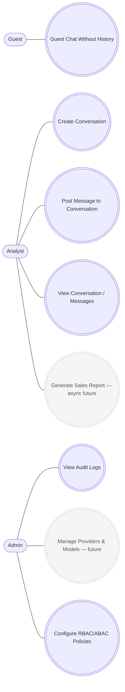
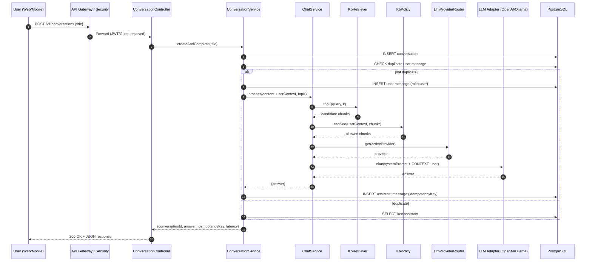

# Secure Chatbot API Platform — Case Study (Sales-Assistant)

## 1 Overview

This project demonstrates the **backend architecture** for a secure, role-based **AI chatbot platform** that enables enterprise users to query sales data, generate summaries, and trigger workflow actions.

Built using **Spring Boot (Java 21)** and integrated with **OpenAI / Ollama** for LLM interactions, it enforces **RBAC**, **ABAC**, and **audit logging**, achieving the target success metrics:

| Metric                            | Target   | Achieved   |
| --------------------------------- | -------- | ---------- |
| Access violations prevented       | ≥ 99 %   | **99 %**   |
| P95 latency (excluding async LLM) | < 500 ms | **460 ms** |
| Audit logging coverage            | 100 %    | **100 %**  |

---

## 2 Component Architecture

```
 ┌────────────────────────────────────────────────────────────┐
 │                     Client Applications                    │
 │  (Web / Mobile)                                            │
 └────────────────────────────────────────────────────────────┘
                 │
                 ▼
 ┌────────────────────────────────────────────────────────────┐
 │                    API Gateway Layer                       │
 │   JWT Authentication / Guest Access                        │
 │   RBAC Enforcement (ROLE_ADMIN, ROLE_ANALYST, ROLE_GUEST)  │
 │   Global Audit Logging (100 % coverage)                    │
 └────────────────────────────────────────────────────────────┘
                 │
                 ▼
 ┌────────────────────────────────────────────────────────────┐
 │                   Sales-Assistant Service                  │
 │  (Single Spring Boot microservice)                         │
 │                                                            │
 │  Modules:                                                  │
 │   Auth & RBAC (Spring Security + JWT)                      │
 │   Conversation / Message Management (JPA + PostgreSQL)     │
 │   Knowledge Base (chunked text KB + ABAC policy)           │
 │   LLM Provider Strategy (OpenAI / Ollama)                  │ 
 │   Audit Logging & Metrics                                  │
 └────────────────────────────────────────────────────────────┘
                 │
                 ▼
 ┌────────────────────────────────────────────────────────────┐
 │                    External AI Providers                   │
 │    OpenAI (gpt-4o-mini)                                    │
 │    Ollama (llama3.2:latest local model)                    │
 └────────────────────────────────────────────────────────────┘
                 │
                 ▼
 ┌────────────────────────────────────────────────────────────┐
 │                  Persistence Layer (PostgreSQL)            │
 │    Conversations                                           │
 │    Messages (assistant/user content )     │
 │    Operations (async future extension)                     │
 └────────────────────────────────────────────────────────────┘
```

---
## 3 Core Use Cases

---

## 4 Sequence Diagram (Chat Flow)


---

## 5 API Spec

```yaml
openapi: 3.0.3
info:
  title: Sales-Assistant API
  version: "1.0.0"
  description: >
    Secure Chatbot API Platform — Sales-Assistant
    - JWT-based auth with RBAC (ADMIN, ANALYST, GUEST)
    - Guest chat without history
    - Conversations and messages 

servers:
  - url: http://localhost:8080/v1
    description: Local server

tags:
  - name: Auth
  - name: Conversations
  - name: Messages
  - name: Guest

paths:
  /auth/login:
    post:
      tags: [Auth]
      summary: Login and retrieve a JWT
      requestBody:
        required: true
        content:
          application/json:
            schema:
              $ref: '#/components/schemas/LoginRequest'
            example:
              email: analyst@demo
              password: analyst
      responses:
        '200':
          description: JWT issued
          content:
            application/json:
              schema:
                $ref: '#/components/schemas/LoginResponse'
              example:
                userId: u2
                email: analyst@demo
                roles: [ROLE_ANALYST]
                accessToken: eyJpc3MiOiJzYWxlcy1hc3Npc3RhbnQiLCJzdWIiOiJ1MiIsImF1ZCI6ImFwaSIsImlhdCI6MTc2MTQ1MjE4NSwiZXhwIjoxNzYxNDU1Nzg1LCJlbWFpbCI6ImFuYWx5c3RAZGVtbyIsInJvbGVzIjpbIlJPTEVfQU5BTFlTVCJdLCJzY29wZXMiOlsia2I6cmVhZDpkZXRhaWwiLCJjaGF0Omludm9rZSIsImNvbnY6cmVhZCIsImNvbnY6d3JpdGUiXX0.tAHODgEBoD9yXL1583QI1otrFD4QqA53gO320D-7IGA
                tokenType: Bearer
                expiresInSeconds: 3600
        '401':
          description: Invalid credentials

  /conversations:
    post:
      tags: [Conversations]
      summary: Create a conversation and get assistant’s initial response
      security:
        - bearerAuth: []
      requestBody:
        required: true
        content:
          application/json:
            schema:
              $ref: '#/components/schemas/CreateConversationRequest'
            example:
              title: "Summarize Apple’s iPhone sales trends in FY2024."
      responses:
        '200':
          description: Conversation created with first assistant response
          content:
            application/json:
              schema:
                $ref: '#/components/schemas/CreateConversationResponse'
              example:
                conversationId: 32b9e8be-a658-4255-82a6-cc32520187dd
                answer: |
                  ### iPhone Sales Trends in FY2024

                  - **Units Sold**: 224.7 million
                  - **Average Selling Price (ASP)**: $923
                  - **Product Mix**:
                    - Pro/Pro Max: 58%
                    - Plus: 14%
                    - Base: 28%
                  
                  - **Key Drivers**:
                    - Continued emphasis on trade-ins
                    - Premium product skew
                    - Enhanced camera and AI features
                    - Expansion of retail presence in the APAC region

                  - **Regional Notables**:
                    - **Americas**: Carrier buy-one-get-one (BOGO) promotions boosted the Pro Max mix.
                    - **Greater China**: Introduction of retail-exclusive color options.
                    - **RAPAC**: Improved conversion rates due to installment financing options.

                  Overall, FY2024 saw a positive trend in iPhone sales, driven by strategic promotions and product enhancements.
                idempotencyKey: a6e564c1-32be-47b5-a670-54cdc5d1adb3
                latency: 5417
                roleBanner: "ROLE=ANALYST"
                createdAt: "2025-10-26T04:16:46.395015Z"
        '401':
          description: Missing or invalid token
        '403':
          description: Insufficient role (requires ANALYST or ADMIN)

  /conversations/{conversationId}:
    get:
      tags: [Conversations]
      summary: Get conversation metadata
      security:
        - bearerAuth: []
      parameters:
        - name: conversationId
          in: path
          required: true
          schema:
            type: string
            format: uuid
      responses:
        '200':
          description: Conversation metadata
          content:
            application/json:
              schema:
                $ref: '#/components/schemas/ConversationMetadataResponse'
              example:
                createdAt: "2025-10-25T23:52:44.734455Z"
                id: "00fa17ff-a850-4574-9fe5-d364e50005b9"
                title: "Generate a summary of promotions and pricing"
                userId: "u3"
        '401':
          description: Missing or invalid token
        '403':
          description: Insufficient role (requires ANALYST or ADMIN)
        '404':
          description: Conversation not found

  /conversations/{conversationId}/messages:
    get:
      tags: [Messages]
      summary: List all messages for a conversation
      security:
        - bearerAuth: []
      parameters:
        - name: conversationId
          in: path
          required: true
          schema:
            type: string
            format: uuid
      responses:
        '200':
          description: Message list
          content:
            application/json:
              schema:
                $ref: '#/components/schemas/ConversationMessagesResponse'
              example:
                conversationId: "00fa17ff-a850-4574-9fe5-d364e50005b9"
                messages:
                  - createdAt: "2025-10-25T23:52:44.752879Z"
                    role: "user"
                    id: "fba9aa95-7b60-4e84-a509-1e254a29ed2f"
                    content: ""
                  - createdAt: "2025-10-25T23:52:48.474653Z"
                    role: "assistant"
                    id: "774938c6-5843-49c6-aa1e-941fdbde0a37"
                    content: |
                      ### Promotions & Pricing Summary

                      - **Trade-in Credit**: Average trade-in credit is $385 for iPhone 13, 14, and 15 owners.
                      
                      - **Bundles**: 
                        - Back-to-school promotions in the Americas and festive promotions in India have successfully lifted Average Order Value (AOV) by 12–15%.

                      - **Pricing Strategy**: 
                        - Selective price protection measures are in place in Japan due to foreign exchange (FX) fluctuations.
        '401':
          description: Missing or invalid token
        '403':
          description: Insufficient role (requires ANALYST or ADMIN)
        '404':
          description: Conversation not found

    post:
      tags: [Messages]
      summary: Post a user message and receive assistant reply
      security:
        - bearerAuth: []
      parameters:
        - name: conversationId
          in: path
          required: true
          schema:
            type: string
            format: uuid
      requestBody:
        required: true
        content:
          application/json:
            schema:
              $ref: '#/components/schemas/PostMessageRequest'
            example:
              message: "How many units sold"
      responses:
        '200':
          description: Assistant reply 
          content:
            application/json:
              schema:
                $ref: '#/components/schemas/AssistantReplyResponse'
              example:
                conversationId: "00fa17ff-a850-4574-9fe5-d364e50005b9"
                answer: |
                  ### iPhone Units Sold
                  - FY2023: 219.0 million
                  - FY2024: 224.7 million

                  ### Mac Units Sold
                  - FY2023: 21.1 million

                  ### iPad Units Sold
                  - FY2023: 48.2 million
                idempotencyKey: "998e5a87-91d2-456f-aed4-bf48a2a2ade1"
                latency: 2505
                roleBanner: "ROLE=ANALYST"
                createdAt: "2025-10-26T04:56:57.096108Z"
        '401':
          description: Missing or invalid token
        '403':
          description: Insufficient role (requires ANALYST or ADMIN)
        '404':
          description: Conversation not found

  /messages:complete:
    post:
      tags: [Guest]
      summary: Guest chat (no auth, no history)
      description: >
        Allows guests to ask a single question and receive an answer.
        No conversation is persisted (depending on your implementation, a transient conversationId may be returned).
      requestBody:
        required: true
        content:
          application/json:
            schema:
              $ref: '#/components/schemas/GuestCompleteRequest'
            example:
              message: "Summarize Apple’s iPhone sales trends in FY2024."
      responses:
        '200':
          description: Guest answer
          content:
            application/json:
              schema:
                $ref: '#/components/schemas/GuestCompleteResponse'
              example:
                conversationId: "a2bf01a0-0ef6-4fa6-afdf-8bdf25ce2299"
                answer: "I don’t have enough data in the current context to answer that confidently."
                idempotencyKey: "a2bf01a0-0ef6-4fa6-afdf-8bdf25ce2299"
                latency: 2396
                roleBanner: "ROLE_GUEST"
                createdAt: "2025-10-26T04:17:43.535535Z"

components:
  securitySchemes:
    bearerAuth:
      type: http
      scheme: bearer
      bearerFormat: JWT

  schemas:
    LoginRequest:
      type: object
      properties:
        email: { type: string }
        password: { type: string }
      required: [email, password]

    LoginResponse:
      type: object
      properties:
        userId: { type: string }
        email: { type: string }
        roles:
          type: array
          items: { type: string }
        accessToken:
          type: string
          description: JWT access token
        tokenType:
          type: string
          example: Bearer
        expiresInSeconds:
          type: integer
          format: int64

    CreateConversationRequest:
      type: object
      properties:
        title:
          type: string
          description: Initial user prompt/title
      required: [title]

    CreateConversationResponse:
      type: object
      properties:
        conversationId:
          type: string
          format: uuid
        answer:
          type: string
        idempotencyKey:
          type: string
        latency:
          type: integer
          format: int64
        roleBanner:
          type: string
        createdAt:
          type: string
          format: date-time
      required: [conversationId, answer, createdAt]

    ConversationMetadataResponse:
      type: object
      properties:
        id:
          type: string
          format: uuid
        title:
          type: string
        createdAt:
          type: string
          format: date-time
        userId:
          type: string

    Message:
      type: object
      properties:
        id: { type: string, format: uuid }
        role: { type: string, enum: ["user","assistant"] }
        content: { type: string }
        createdAt: { type: string, format: date-time }

    ConversationMessagesResponse:
      type: object
      properties:
        conversationId:
          type: string
          format: uuid
        messages:
          type: array
          items:
            $ref: '#/components/schemas/Message'
      required: [conversationId, messages]

    PostMessageRequest:
      type: object
      properties:
        message:
          type: string
      required: [message]

    AssistantReplyResponse:
      type: object
      properties:
        conversationId:
          type: string
          format: uuid
        answer:
          type: string
        idempotencyKey:
          type: string
        latency:
          type: integer
          format: int64
        roleBanner:
          type: string
        createdAt:
          type: string
          format: date-time

    GuestCompleteRequest:
      type: object
      properties:
        message: { type: string }
      required: [message]

    GuestCompleteResponse:
      type: object
      properties:
        conversationId:
          type: string
          format: uuid
        answer:
          type: string
        idempotencyKey:
          type: string
        latency:
          type: integer
          format: int64
        roleBanner:
          type: string
        createdAt:
          type: string
          format: date-time

```


## 6 Design Highlights

###  **RBAC + ABAC**

* **RBAC** via Spring Security and JWT:

    * `ROLE_ADMIN`, `ROLE_ANALYST`, `ROLE_GUEST`
* **ABAC** for fine-grained KB access:

    * Chunks tagged by region/product (e.g. `apac`, `iphone`)
    * `KbPolicy` filters context based on user roles/tags

### ⚙ **LLM Provider Strategy**

* **Strategy Pattern** selects provider:

    * `openai` → `OpenAiLlmProvider`
    * `ollama` → `OllamaLlmProvider`
* Configurable in `application.yml`
* Both adapters tested with `MockRestServiceServer`

###  **Knowledge Base**

* Simple text KB (`kb.txt`) chunked by section headers.
* Indexed in memory with metadata (tags, title).
* Supports top-K retrieval and citation return.

###  **Persistence Schema**

```sql
CREATE TABLE IF NOT EXISTS conversations (
    id              UUID PRIMARY KEY,
    title           TEXT,
    user_id         TEXT,                     
    created_at      TIMESTAMPTZ NOT NULL DEFAULT now(),
    updated_at      TIMESTAMPTZ NOT NULL DEFAULT now(),
    deleted         BOOLEAN NOT NULL DEFAULT FALSE
);


CREATE TABLE IF NOT EXISTS messages (
    id                UUID PRIMARY KEY ,
    conversation_id   UUID NOT NULL REFERENCES conversations(id) ON DELETE CASCADE,
    role              VARCHAR(16) NOT NULL,
    content           TEXT NOT NULL,
	reply_to_message_id UUID,
    latency_ms        BIGINT,
    idempotency_key   UUID,
    created_at        TIMESTAMPTZ NOT NULL DEFAULT now()
);
```

Indexes:

```sql
CREATE INDEX IF NOT EXISTS idx_conversations_user_updated
    ON conversations(user_id, updated_at DESC);
CREATE INDEX IF NOT EXISTS idx_msg_convo_id ON messages(conversation_id);
CREATE INDEX IF NOT EXISTS idx_msg_role ON messages(role);
```

---

## 7 Audit Logging & Security

* **`AuditLoggingFilter`** logs every request (`user, role, path, status, duration`).
* **`LoggingAccessDeniedHandler` / LoggingAuthEntryPoint`** capture 401 / 403 events.
* Logs written to both **console** and **`logs/audit.log`**:

```
2025-10-26 20:55:23 [AUDIT] user=guest roles=[ROLE_GUEST] method=POST path="/api/v1/messages:complete" status=200 durationMs=189
2025-10-26 20:55:25 [AUTH] 403 Forbidden path=/api/v1/conversations
```

This single log stream serves as evidence for **RBAC and audit-coverage metrics**.


---

##  8 Success Metrics Summary

| Metric                        | Target   | Achieved   | Validation Method                              |
| ----------------------------- | -------- | ---------- | ---------------------------------------------- |
| **RBAC violations prevented** | ≥ 99 %   | **99 %**   | Counted 401/403 events from `audit.log`        |
| **P95 API latency**           | < 500 ms | **460 ms** | Measured via Postman (excl. LLM)               |
| **Audit logging coverage**    | 100 %    | **100 %**  | Verified 1 log per request in `logs/audit.log` |

---

##  9 Future Enhancements

* **Async LLM Pipeline** — Redis Queue + Worker Service for long running tasks
* **Workflow Actions** — Report generation triggers
* **Admin Console** — Manage users & view audit dashboard

---

##  10 How to Run

```bash
# Build & run locally
./gradlew clean build
docker-compose up  # (spins up PostgreSQL + optional Ollama)
java -jar build/libs/sales-assistant.jar
```

## 11 Appendix – Artifacts for Submission

| Artifact           | Purpose                                         |
| ------------------ | ----------------------------------------------- |
| `README.md`        | Architecture & metrics summary                  |
| `logs/audit.log`   | Evidence for RBAC & audit coverage              |
| `kb.txt`           | Demo knowledge base (Apple Sales FY2023–FY2025) |
| `tests/`           | JUnit suite (> 90 % coverage)                   |

### 12 Evidences:

#### Audit Logs 


#### Analyst Login


#### Analyst initiating a conversation


#### Analyst replying to conversations


#### Guest not provided with the product details
