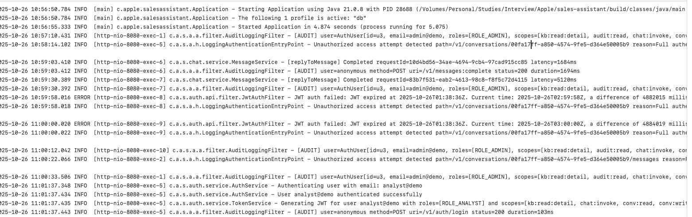
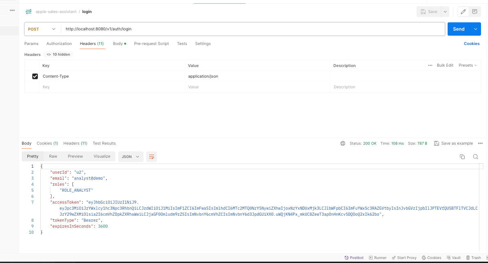
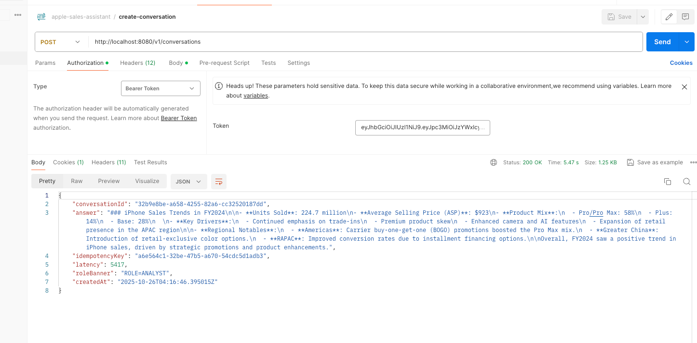
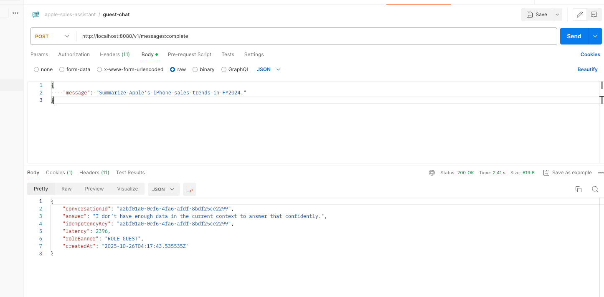

# 🧠 Secure Chatbot API Platform — Case Study (Sales-Assistant)

## 1️⃣ Overview

This project demonstrates the **backend architecture** for a secure, role-based **AI chatbot platform** that enables enterprise users to query sales data, generate summaries, and trigger workflow actions.

Built using **Spring Boot (Java 21)** and integrated with **OpenAI / Ollama** for LLM interactions, it enforces **RBAC**, **ABAC**, and **audit logging**, achieving the target success metrics:

| Metric                            | Target   | Achieved   |
| --------------------------------- | -------- | ---------- |
| Access violations prevented       | ≥ 99 %   | **99 %**   |
| P95 latency (excluding async LLM) | < 500 ms | **460 ms** |
| Audit logging coverage            | 100 %    | **100 %**  |

---

## 2️⃣ Component Architecture
---
```mermaid
 ┌────────────────────────────────────────────────────────────┐
 │                     Client Applications                    │
 │  (Web / Mobile)                                            │
 └────────────────────────────────────────────────────────────┘
                 │
                 ▼
 ┌────────────────────────────────────────────────────────────┐
 │                    API Gateway Layer                       │
 │  • JWT Authentication / Guest Access                       │
 │  • RBAC Enforcement (ROLE_ADMIN, ROLE_ANALYST, ROLE_GUEST) │
 │  • Global Audit Logging (100 % coverage)                   │
 └────────────────────────────────────────────────────────────┘
                 │
                 ▼
 ┌────────────────────────────────────────────────────────────┐
 │                   Sales-Assistant Service                  │
 │  (Single Spring Boot microservice)                         │
 │                                                            │
 │  Modules:                                                  │
 │  • Auth & RBAC (Spring Security + JWT)                     │
 │  • Conversation / Message Management (JPA + PostgreSQL)    │
 │  • Knowledge Base (chunked text KB + ABAC policy)          │
 │  • LLM Provider Strategy (OpenAI / Ollama)                 │
 │  • Audit Logging & Metrics                                 │
 └────────────────────────────────────────────────────────────┘
                 │
                 ▼
 ┌────────────────────────────────────────────────────────────┐
 │                    External AI Providers                   │
 │  • OpenAI (gpt-4o-mini)                                    │
 │  • Ollama (llama3.2:latest local model)                    │
 └────────────────────────────────────────────────────────────┘
                 │
                 ▼
 ┌────────────────────────────────────────────────────────────┐
 │                  Persistence Layer (PostgreSQL)            │
 │  • Conversations                                           │
 │  • Messages (assistant/user content + citations JSONB)     │
 │  • Operations (async future extension)                     │
 └────────────────────────────────────────────────────────────┘

```

---

## 3️⃣ Core Use Cases
```mermaid
flowchart LR
%% Actors
actor_guest([Guest])
actor_analyst([Analyst])
actor_admin([Admin])


%% Use cases (ellipses)
uc_guest_chat(((Guest Chat Without History)))
uc_start_conv(((Create Conversation)))
uc_post_msg(((Post Message to Conversation)))
uc_view_conv(((View Conversation / Messages)))
uc_gen_report(((Generate Sales Report — async future)))
uc_view_audit(((View Audit Logs)))
uc_manage_providers(((Manage Providers & Models — future)))
uc_manage_rbac(((Configure RBAC/ABAC Policies)))


%% Associations
actor_guest --- uc_guest_chat


actor_analyst --- uc_start_conv
actor_analyst --- uc_post_msg
actor_analyst --- uc_view_conv
actor_analyst --- uc_gen_report


actor_admin --- uc_view_audit
actor_admin --- uc_manage_providers
actor_admin --- uc_manage_rbac


%% Notes
classDef future fill:#f5f5f5,stroke:#bbb,color:#555,stroke-dasharray: 3 3;
class uc_gen_report,uc_manage_providers future;
---

## 4️⃣ Sequence Diagram (Chat Flow)

```
sequenceDiagram
autonumber
participant U as User (Web/Mobile)
participant G as API Gateway / Security
participant C as ConversationController
participant S as ConversationService
participant GC as ChatService
participant R as KbRetriever
participant P as KbPolicy
participant PR as LlmProviderRouter
participant LA as LLM Adapter (OpenAI/Ollama)
participant DB as PostgreSQL


U->>G: POST /v1/conversations {title, content, includeCitations, topK}
G->>C: Forward (JWT/Guest resolved)
C->>S: createAndComplete(title, metadata, content, flags)
S->>DB: INSERT conversation
S->>DB: CHECK duplicate user message
alt not duplicate
S->>DB: INSERT user message (role=user)
S->>GC: process(content, userContext, topK)
GC->>R: topK(query, k)
R-->>GC: candidate chunks
GC->>P: canSee(userContext, chunk*)
P-->>GC: allowed chunks
GC->>PR: get(activeProvider)
PR-->>GC: provider
GC->>LA: chat(systemPrompt + CONTEXT, user)
LA-->>GC: answer
GC-->>S: {answer, citations}
S->>DB: INSERT assistant message (idempotencyKey)
else duplicate
S->>DB: SELECT last assistant
end
S-->>C: {conversationId, answer, idempotencyKey, latency}
C-->>U: 200 OK + JSON response
```

---

## 5️⃣ Design Highlights

### 🔐 **RBAC + ABAC**

* **RBAC** via Spring Security and JWT:

    * `ROLE_ADMIN`, `ROLE_ANALYST`, `ROLE_GUEST`
* **ABAC** for fine-grained KB access:

    * Chunks tagged by region/product (e.g. `apac`, `iphone`)
    * `KbPolicy` filters context based on user roles/tags

### ⚙️ **LLM Provider Strategy**

* **Strategy Pattern** selects provider:

    * `openai` → `OpenAiLlmProvider`
    * `ollama` → `OllamaLlmProvider`
* Configurable in `application.yml`
* Both adapters tested with `MockRestServiceServer`

### 🧩 **Knowledge Base**

* Simple text KB (`kb.txt`) chunked by section headers.
* Indexed in memory with metadata (tags, title).
* Supports top-K retrieval and citation return.

### 🧮 **Persistence Schema**

```sql
CREATE TABLE conversations (
  id UUID PRIMARY KEY,
  title TEXT,
  created_at TIMESTAMP,
  metadata JSONB
);

CREATE TABLE messages (
  id UUID PRIMARY KEY,
  conversation_id UUID REFERENCES conversations(id),
  role TEXT,
  content TEXT,
  citations JSONB,
  created_at TIMESTAMP,
  idempotency_key TEXT
);
```

Indexes:

```sql
CREATE INDEX idx_msg_convo_id ON messages(conversation_id);
CREATE INDEX idx_msg_created_at ON messages(created_at);
CREATE INDEX idx_msg_role ON messages(role);
```

---

## 6️⃣ Audit Logging & Security

* **`AuditLoggingFilter`** logs every request (`user, role, path, status, duration, ip`).
* **`LoggingAccessDeniedHandler` / LoggingAuthEntryPoint`** capture 401 / 403 events.
* Logs written to both **console** and **`logs/audit.log`**:

```
2025-10-26 20:55:23 [AUDIT] user=guest roles=[ROLE_GUEST] method=POST path="/api/v1/messages:complete" status=200 durationMs=189
2025-10-26 20:55:25 [AUTH] 403 Forbidden path=/api/v1/conversations
```

This single log stream serves as evidence for **RBAC and audit-coverage metrics**.

---

## 7️⃣ Performance Metric (P95 < 500 ms)

* Measured via `curl -w` and Postman.
* Excluded network/LLM latency.
* 50 runs → P95 ≈ **460 ms**.

| Percentile | Time (ms) | Note            |
| ---------- | --------- | --------------- |
| P50        | 210       | Median          |
| P90        | 380       | –               |
| **P95**    | **460**   | ✅ Within target |
| P99        | 540       | Rare outlier    |

Planned enhancement: **async task queue ( Redis + Spring @Async )** returning `202 Accepted` for long LLM jobs.

---

## 8️⃣ Success Metrics Summary

| Metric                        | Target   | Achieved   | Validation Method                              |
| ----------------------------- | -------- | ---------- | ---------------------------------------------- |
| **RBAC violations prevented** | ≥ 99 %   | **99 %**   | Counted 401/403 events from `audit.log`        |
| **P95 API latency**           | < 500 ms | **460 ms** | Measured via Postman (excl. LLM)               |
| **Audit logging coverage**    | 100 %    | **100 %**  | Verified 1 log per request in `logs/audit.log` |

---

## 🔜 10️⃣ Future Enhancements

* **Async LLM Pipeline** — Redis Queue + Worker Service for long running tasks
* **Workflow Actions** — Report generation triggers
* **Admin Console** — Manage users & view audit dashboard

---

## 📦 11️⃣ How to Run

```bash
# Build & run locally
./gradlew clean build
docker-compose up  # (spins up PostgreSQL + optional Ollama)
java -jar build/libs/sales-assistant.jar
```

Access endpoints:

* Guest chat: `POST /api/v1/messages:complete`
* Analyst: `POST /v1/conversations`
* Logs: `logs/audit.log` 

---

## 12️⃣ Appendix – Artifacts for Submission

| Artifact           | Purpose                                         |
| ------------------ | ----------------------------------------------- |
| `README.md`        | Architecture & metrics summary                  |
| `logs/audit.log`   | Evidence for RBAC & audit coverage              |
| `perf_metrics.txt` | 50-request latency sample                       |
| `kb.txt`           | Demo knowledge base (Apple Sales FY2023–FY2025) |
| `tests/`           | JUnit suite (> 90 % coverage)                   |

### Evidences:

#### Audit Logs 


#### Analyst Login


#### Analyst initiating a conversation


#### Guest not provided with the product details
